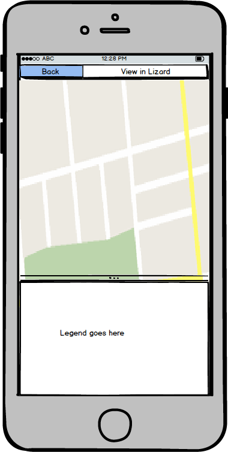

# Parramatta mobile interactive dashboard

## Project, offerte

S0024 - Parramatta River Flood Information System RHDHV

In het voorstel voor dit grotere project is ook een "interactive
dashboard" aangeboden; in de woorden van het voorstel:

> The Lizard data portal already has an operational mobile viable
> dashboard app consisting of interactive tiles showing different
> combinations of snap shots served by the Lizard API. In the project we
> just have to get consensus on what to show on the app pages. Many
> options are available, and others can easily be developed.

Met screenshots van de Klimaatatlas erbij.

De specifieke requirement is

> A dashboard front page with interactive tiles showing; a map of gauges
> and real time levels, relevant BoM forecast map, triggers breached,
> links to forecast impact data and maps.

Dit dashboard bestaat nog niet, dit plan beschrijft wat we hoe gaan
maken.

## Context Nelen & Schuurmans

Het beeld is dat dit punt niet het belangrijkste deel van de offerte
is voor de klant. We moeten zorgen dat we de implementatie op een
dusdanige manier doen dat voldaan wordt aan de offerte, en de
geschreven software later ook nog hergebruikt kan worden voor andere
doeleinden binnen N&S.

Voor G4AW wordt ook een app ontwikkeld, deze maakt gebruikt van voor
ons nieuwe technologie (de combinatie van React en Redux, met een
losse Javascript library voor het benaderen van de Lizard API). Het
voorstel is om voor de Parramatta app dezelfde stack te gebruiken. Op
deze manier bouwen we eerst een paar kleine apps, doen ervaring op, en
kunnen dan grotere apps bouwen. Hiermee moet het probleem voorkomen
worden dat we nieuwe technologie introduceren in een groot project en
na twee jaar tot de conclusie komen dat het te complex geworden is --
tegen de tijd dat we grote projecten met de nieuwe stack bouwen, zijn
we er al vertrouwd mee.

## Idee user interface

De voorpagina van de interface gaat lijken op die van de Klimaatatlas;
wit met "tiles" (vast 256x256 pixels per tile) die de verschillende
kaarten / grafieken voorstellen. Elke tile heeft ook een titel. De
Klimaatatlas is overzichtelijk, heeft succes en screenshots ervan zijn
gebruikt in de offerte. Technisch is er alleen niet zo veel dat
hergebruikt kan worden.

Op elke tile kan geklikt worden, wat hem fullscreen maakt. Een
kaartlagen tile laat de kaart zien, een tijdserie tile de hele
grafiek, et cetera.

De functionaliteit is beperkt. Elke tile is gekoppeld aan een opgeslagen
favourite in Lizard. In de fullscreen versie van een tile
is altijd een button "To Lizard", die leidt naar de favourite in Lizard.

De tiles staan op een smal scherm (zoals een telefoon) onder elkaar,
maar als het scherm breder is dan wordt de ruimte dynamisch opgevuld
door meerdere tiles naast elkaar te zetten, zoals op de bestaande
Klimaatatlas site:

Er zijn enkele verschillende soorten informatie, die hun eigen tiles
gaan krijgen:

* Kaarten met rasterdata
* Kaarten met assets waar timeseries aan hangen
* Timeserie tile (willen we graag kunnen, maar staat niet in de offerte)
* Triggers breached
* Neerslaganimaties

Welke exact getoond gaan worden is nu nog niet bepaald, maar dit wordt
eenmalig door ons configureerbaar en staat daarna vast, het is voor
alle gebruikers gelijk. Een gebruiker moet eerst inloggen omdat de
data niet noodzakelijk publiek is, en de app bedoeld is voor
gebruikers met een account. Dit voorkomt problemen met linken naar
favourites waarvan niet alle data bekeken mag worden.

Elke soort tile heeft twee elementen: iets dat getoond wordt op de
voorpagina in de tile (altijd 256x256 pixels, net als een WMS tile --
niet toevallig), en een full screen view die getoond wordt als op de
tile geklikt wordt.

### Rasterdata kaart

De tile zelf is een 256x256 WMS tile (net als bij de
Klimaatatlas). Dit is een stukje van de daadwerkelijke kaart; de
getoonde data is up to date, maar het is altijd dezelfde plek.

Als er op geklikt wordt is het een interactieve kaart (kan pannen en
zoomen). Een legenda kan van onderaf omhoog geschoven worden. Alleen
rasterlagen worden ondersteund.

Rescalen van DEM laag doen we nog niet in deze app.

### Asset kaart

De tile zelf is een 256x256 WMS tile. Er kan 1 type asset getoond
worden, met een vast icon. De getoonde data is up to date, maar het is
altijd dezelfde plek.

De fullscreen versie is een interactive kaart (kan pannen en zoomen),
zonder legenda. Op een asset kan geklikt worden, dan wordt een
bijbehorende timeserie getoond in een grafiek, ook fullscreen met een
'Back' button om terug te gaan naar de kaart.

Gebruikt UTFGrid.

### Timeserie tile

Laat een kleine versie van de grafiek zien in de tile, van een vaste
periode, bijvoorbeeld de laatste en komende 24 uur (exacte tijd kunnen
we later nog vaststellen).

De fullscreen versie is de grafiek van de timeserie, deze kan in de
tijd verschoven worden, gezoomd, en er is een legenda (zelfde UI
element wordt hierboven gebruikt in de asset kaart).

### Triggers breached

Dit is zeer speculatief, ik weet nog niets over hoe triggers gaan werken.

De tile: een tekst '2 triggers breached in the last 24 hours'.

Fullscreen versie: een infinite scrollbare lijst met de laatste triggers
breached, puur tekst met een tijd en een omschrijving, meest recente
bovenaan.

Als tijdens het scrollen blijkt dat er nieuwe triggers breached zijn,
springt hij terug naar bovenaan de lijst en laat de nieuwe situatie zien.
De nieuwe events moeten daarbij even oplichten.

WE NEMEN AAN DAT DE BACKEND EN API HIERVAN BUITEN DEZE PLANNING VALT.

### Neerslaganimatie

Deze loopt over een vaste periode, bijvoorbeeld de laatste 24 uur en
komende 24 uur.

De tile is een 256x256 animated GIF die op de server eens in de x
minuten klaargezet wordt van een vast gebied.

De fullscreen versie is een interactieve kaart met radarbeelden en een
omhuig schuifbare legenda, die ook loopt over de vaste periode. Een
tijd onderin in beeld, en een play / pause button.

## Wat moeten we allemaal maken

### Backend

Django backend: een manier om te configureren welke tiles er zijn en
bij welke favourites die horen, welke lagen er bij horen en
dergelijke. [1d]

API die die data aan de client geeft, client code die dezelfde data
kan representeren. [1d]

Installeren op http://parramatta.lizard.net/dashboard/ [0.5d]

Script dat regenanimatie GIF genereert, op server hebben, cacheing,
deployment hiervan, etc. [2d]

### Frontend

Login mechanisme. [1d]

React component voor de hele app. [0.5d]

React component voor de tiles-pagina. [0.5d]

React components voor de tile en de fullscreen pagina van:

- Raster map [0.5d voor de kaart, 3d voor de legenda component]
- Asset map [1d UTFGrid code overnemen uit Gijs' demo, asset gegevens laten zien. Timeseries als we die ook doen]
- Triggers breached [2d als API ervan af is]
- Timeseries [Ligt er helemaal aan welke features we allemaal gaan ondersteunen, 2d - 2w]
- Regenanimatie [2d voor het laten animeren (en 2 maand voor het perfect laten werken...)]

#

Conclusie tijdsinschatting: Totaal **17 - 25 dagen** (range ligt aan timeseries wensen).
